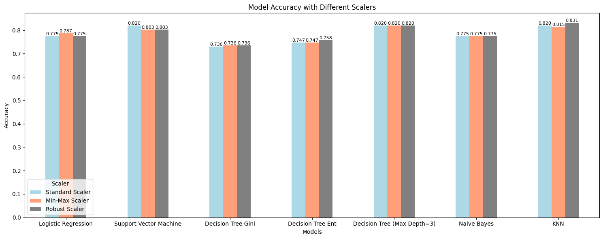

# Titanic Survivor Prediction Project

This project predicts the survival of Titanic passengers using machine learning classification models.

## Files Included

- **titanic.ipynb**: Jupyter Notebook containing EDA, preprocessing, model training, and evaluation.

## Presentation

You can access the project presentation [here](https://docs.google.com/presentation/d/1agy34EnWOaLNOPJhSOyREYC6YkwQNcPPD-qNd9cIWrU/edit?usp=sharing). 

## Project Overview

- **Dataset**: Titanic dataset from Kaggle competition.  
- **Models Used**: Logistic Regression, KNN, Decision Tree, SVM, Naive Bayes.  
- **Feature Scaling**: StandardScaler, MinMaxScaler, RobustScaler.  
- **Best Model**: KNN with RobustScaler (accuracy score: 0.831).

Below is a quick visual of the model accuracies:

